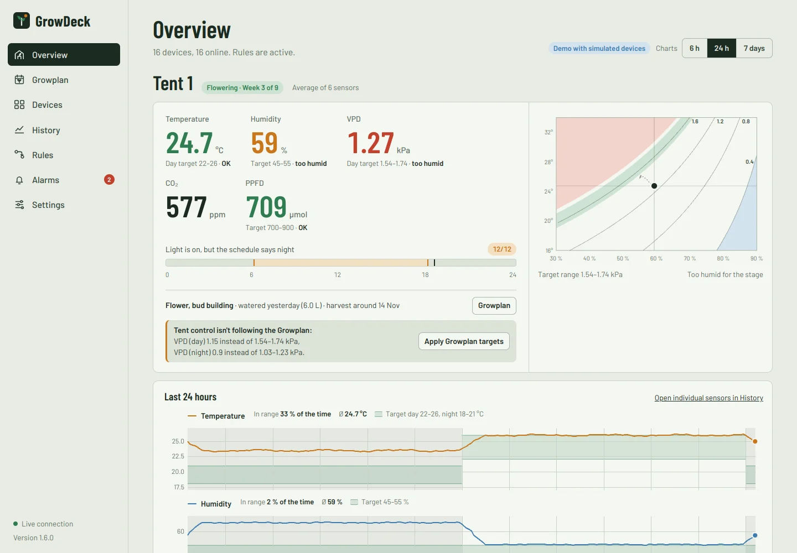
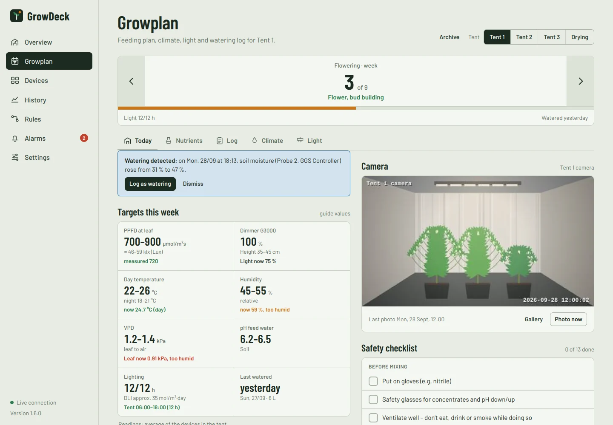
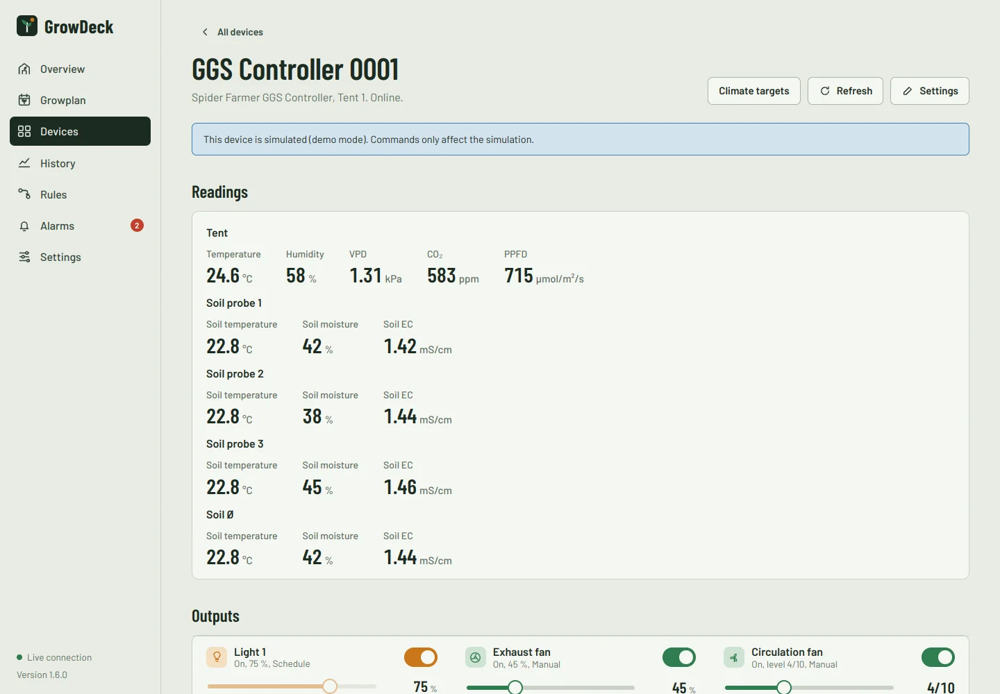
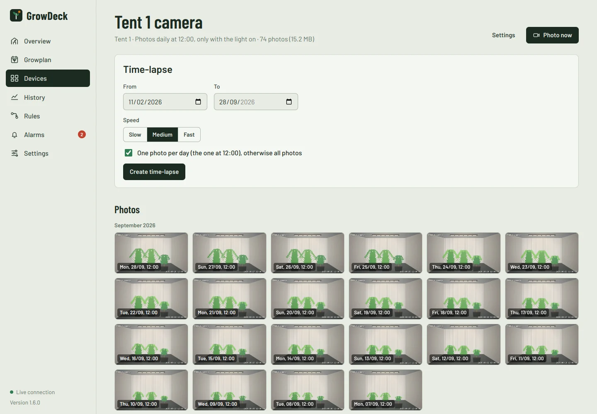
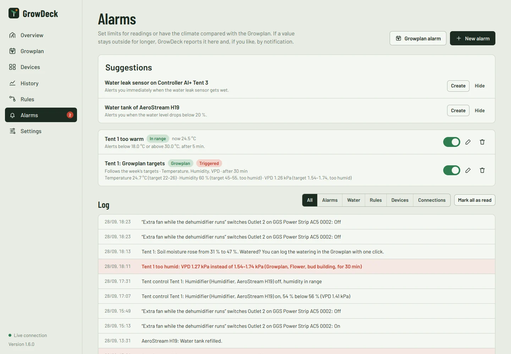
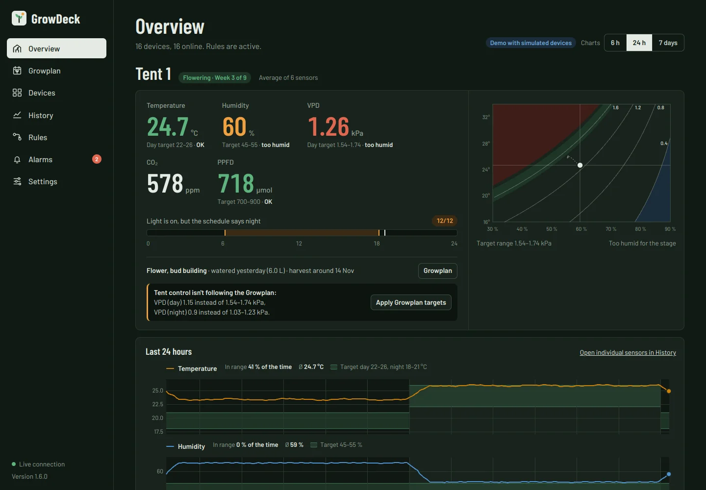
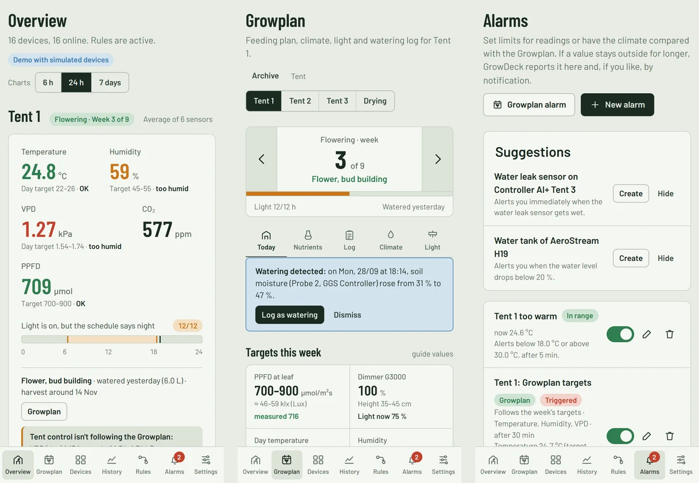
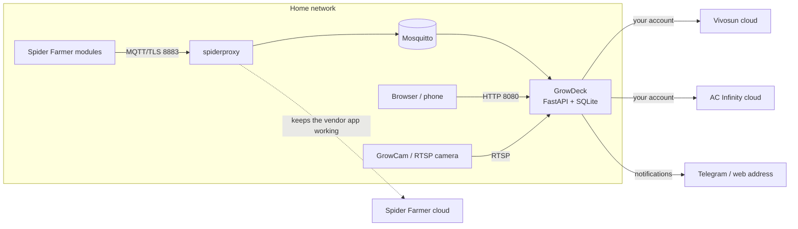

# GrowDeck

**One self-hosted dashboard for your grow tents – Spider Farmer, Vivosun and AC Infinity together.**

[](https://flippowitch.github.io/GrowDeck/)
[](https://github.com/flippowitch/GrowDeck/actions/workflows/ci.yml)


GrowDeck brings the devices of **Spider Farmer (GGS)**, **Vivosun (GrowHub)** and
**AC Infinity (UIS)** into one web interface: climate per tent with a VPD chart, every
output switched and dimmed, schedules and modes set directly on the devices, history,
rules across brands, alarms and notifications. On top of that comes the **Growplan** –
weekly feeding schedule, climate and light targets, safety checklist and watering log,
linked to the devices in the tent – plus alarms that follow the plan, watering
reminders, daily photos with time-lapse, an archive of finished grows and nightly
backups. It runs as a Docker project on a NAS (built for UGREEN UGOS Pro) or any Linux
box, and speaks English and German.

**[▶ Try the live demo](https://YOUR-GITHUB-USER.github.io/growdeck/)** – it runs entirely in
your browser with simulated devices; nothing is sent anywhere, and a reload resets it.



<details>
<summary>More screenshots</summary>

| | |
|---|---|
|  |  |
|  |  |
|  |  |

</details>

> 🇩🇪 Deutsche Anleitung: [README.de.md](README.de.md)

## Contents

- [Features](#features)
- [Supported devices](#supported-devices)
- [How it works](#how-it-works)
- [Installation](#installation)
- [Connecting the brands](#connecting-the-brands)
- [Documentation](#documentation)
- [Configuration reference](#configuration-reference)
- [Security](#security)
- [Status and limitations](#status-and-limitations)
- [Development](#development)
- [License and credits](#license-and-credits)

## Features

- **Overview per tent** – temperature, humidity, VPD, CO₂ and PPFD with the targets of the
  current stage, a VPD chart, 6 h / 24 h / 7 day trends with day/night shading and time in
  range, and every device of the tent with its outputs.
- **All outputs, all modes** – switch, dim and configure Spider Farmer outlets and lights,
  Vivosun GrowHub, AeroStream, AeroFlux, AeroLush, VCure and GrowHub A10/A22 plugs, and every
  AC Infinity UIS port with its native modes (auto, timer, cycle, schedule, VPD …).
  Settings are stored on the devices, so they keep running without GrowDeck.
- **Tent control across brands** – one climate controller per tent that coordinates
  exhaust, circulation, humidifier, dehumidifier, heater, cooling and CO₂ of any brand,
  with day/night targets and the light's real state as day signal.
- **Rules** – thresholds (with night values and hysteresis), time windows, intervals and
  “when device X is on” couplings between devices of different brands.
- **Alarms** – limits per sensor, plus alarms that follow the Growplan's targets week by
  week, day and night.
- **Growplan** – feeding schedules (Advanced Nutrients, BioBizz, Advanced Hydroponics or
  your own), “mix a batch” calculator, climate and light targets per week, safety
  checklist, plants, watering log with EC/pH charts, backups compatible with the Growplan
  app.
- **Watering** – reminders after N days or when the soil gets dry, waterings detected by
  the soil probes, “tank almost empty” warnings.
- **Cameras** – daily photos from a Vivosun GrowCam or any RTSP / snapshot camera, gallery,
  time-lapse videos, photos attached to log entries.
- **Grow archive** – finish a grow and keep plan, log, yield, g/W, energy estimate, climate
  per stage and photos; compare grows side by side.
- **Notifications** – Telegram and any web address (ntfy, Home Assistant, Node-RED),
  bundled and de-duplicated, in English or German.
- **Backups** – nightly database backups with download, upload and one-click restore.
- **Phone-friendly, dark mode, English and German.**

## Supported devices

| Brand | Device | In GrowDeck |
|---|---|---|
| Spider Farmer | GGS Controller | Climate (temperature, humidity, VPD, CO₂, PPFD), soil probes, light dimming, exhaust, circulation incl. natural wind, heater, humidifier, dehumidifier (on/off, mode); schedules, cycles, climate modes, climate targets |
| Spider Farmer | GGS Power Strip AC5 / AC10 | All outlets with all modes (manual, schedule, cycle, temperature, humidity, CO₂, drip irrigation with soil probe), light channels, own sensors |
| Spider Farmer | GGS Light Controller | Light 1 and 2: dimming, schedule with brightness, cycle, PPFD automation, heat protection |
| Spider Farmer | Sensors (temp/humidity, SensorPro PPFD, CO₂, 3-in-1 soil probe) | As readings of their controller |
| Spider Farmer | Unknown or new GGS modules | Detected generically: readings and switchable outputs, as far as they follow the GGS schema |
| Vivosun | GrowHub controllers (e.g. E42A) | Inside/outside climate, VPD, light (level, spectrum), exhaust incl. auto limits, circulation (level, oscillation, natural wind, night mode) |
| Vivosun | AeroStream humidifier, AeroFlux heater, dehumidifier, AeroLush air conditioner | On/off, level and mode, targets, operating mode and fan level (air conditioner), water level |
| Vivosun | VCure (drying/curing) | Climate in the box, programmes (quick, refine, curing, cold, extract), light, privacy glass, lock |
| Vivosun | GrowHub A10 / A22 Wi-Fi plugs | On/off per outlet (A22: two outlets and USB), A22 probe |
| Vivosun | GrowCam | Photos at set times via RTSP in the home network, gallery, time-lapse |
| Other cameras | Anything with an RTSP stream or a snapshot URL | Same as GrowCam |
| AC Infinity | Controller 69 WiFi, 69 Pro, 69 Pro+ | Temperature, humidity, VPD; every UIS port with on/off, level 0–10 and all modes (off, on, auto, timer, cycle, schedule, VPD) incl. limits, targets, timers |
| AC Infinity | Controller AI+ | As above, plus the plug-in sensors (CO₂ + light, soil moisture, water leak, pH, EC/TDS, water temperature) and their sensor modes |
| AC Infinity | UIS Outlet AI / AI+ | Every outlet with on/off and all modes |
| AC Infinity | Controller 67, Controller 69 without Wi-Fi | Not possible: they only use Bluetooth and never reach the cloud |

## How it works



- **Spider Farmer** modules only talk to `sf.mqtt.spider-farmer.com`. Your network points
  that name to the NAS; a small proxy receives the connection, hands the data to GrowDeck
  and at the same time stays connected to the Spider Farmer cloud, so the official app
  keeps working.
- **Vivosun** and **AC Infinity** offer no local interface for these devices; GrowDeck uses
  your account through their clouds, like their apps do.
- Everything else – rules, tent control, alarms, history, photos – runs locally.

Each brand has an adapter that translates its devices into one common model of sensors
and outputs; rules, alarms, history and the UI only work with that model.

## Installation

### Requirements

- Docker with Docker Compose – UGREEN UGOS Pro: the **Docker** app; Synology: Container
  Manager; any Linux: Docker Engine.
- Internet access for the first start (building the images) and for Vivosun, AC Infinity
  and Telegram.
- For Spider Farmer: a way to point `sf.mqtt.spider-farmer.com` to your NAS (see
  [below](#spider-farmer)).

### Quick start (any Docker host)

```sh
git clone https://github.com/YOUR-GITHUB-USER/growdeck.git
cd growdeck
cp .env.example .env          # then edit .env – at least APP_PASSWORD
sudo docker compose up -d --build
sudo docker compose logs -f growdeck
```

Open `http://IP-OF-YOUR-HOST:8080` and sign in with `APP_PASSWORD`. If you leave it empty,
GrowDeck generates one and writes it to the container log and to
`data/generated-password.txt`.

### UGREEN NAS (UGOS Pro) step by step

1. Download this repository (green **Code** button → **Download ZIP**) and unpack it. Copy
   the folder to the NAS, e.g. to `/volume1/docker/growdeck` (shared folder “docker”).
2. In that folder copy `.env.example` and name the copy `.env`. Set at least
   `APP_PASSWORD` – the text editor of the UGOS file manager works for this.
3. In the Docker app choose **Project → Create**, give it a name (e.g. `growdeck`) and pick
   the `growdeck` folder as path. UGOS detects `docker-compose.yml`. Click **Deploy**. The
   first start takes a few minutes because the images are built.
4. Open `http://NAS-IP:8080`.

### Try it first: demo mode

With `DEMO_MODE=true` in `.env`, GrowDeck starts with simulated devices of all three
brands, example rooms, rules, alarms, a demo camera with photos and an archived grow –
everything can be operated without hardware. To switch to real devices set
`DEMO_MODE=false`, delete the `data` folder and restart the project.

### Updating

Replace the files with the new version (keep `.env` and `data/`), then rebuild:

```sh
git pull                      # or copy the new files over the old ones
sudo docker compose up -d --build
```

In the UGOS Docker app: select the project → **Stop**, then **Build** and start it again.

## Connecting the brands

### Spider Farmer

The GGS modules only connect to `sf.mqtt.spider-farmer.com` (port 8883, TLS). The container
`growdeck-spiderproxy` accepts this connection on the NAS, forwards the data to GrowDeck
and keeps the connection to the Spider Farmer cloud, so the Spider Farmer app keeps
working. The name has to resolve to your NAS inside your home network. Three ways:

**A. Built-in DNS service (Fritz!Box and similar routers)**

1. In `.env` enable `COMPOSE_PROFILES=dns` and set `NAS_IP` to the NAS's address (give the
   NAS a fixed IP in the router).
2. Redeploy. The container `growdeck-dns` answers only this one name itself and forwards
   everything else to 1.1.1.1 and 9.9.9.9.
3. Fritz!Box: *Home Network → Network → Network Settings → IPv4 Settings* → set “Local DNS
   server” to the NAS's IP. The Fritz!Box then hands out the NAS as DNS server via DHCP.

If port 53 is already in use on the NAS, the DNS service won't start – use B or C.

**B. Existing DNS filter (AdGuard Home, Pi-hole)** – add a DNS rewrite
`sf.mqtt.spider-farmer.com` → NAS IP. The DNS service from A isn't needed.

**C. Router with NAT rules (OpenWrt, OPNsense, pfSense, UniFi)** – redirect connections of
the Spider Farmer modules to port 8883 to the NAS (destination NAT).

Then power-cycle the modules. After about a minute they appear under **Devices**.
**Settings → Connections** shows whether the broker is connected and how many messages
arrive.

> The `spiderproxy` comes from the project
> [Schedule 4 Real](https://github.com/EddiePiazza/schedule-4-real) and is **not part of
> GrowDeck**. It is published only as a binary without source code or license; the
> Dockerfile downloads it from a pinned commit of that public repository when building.
> Decide yourself whether you want to use it. Without Spider Farmer devices, remove the
> `spiderproxy` service from `docker-compose.yml` and set `SPIDERFARMER_ENABLED=false`.

### Vivosun

Enter the e-mail and password of your Vivosun account under **Settings → Connections**
(or `VIVOSUN_EMAIL` / `VIVOSUN_PASSWORD` in `.env`). GrowDeck reads the values about every
minute and sends commands immediately through the cloud. Without internet, Vivosun
devices can't be reached from GrowDeck; their own settings keep running on the devices.

### AC Infinity

Enter your AC Infinity account under **Settings → Connections** (or `ACINFINITY_EMAIL` /
`ACINFINITY_PASSWORD`). The controllers are polled every 10 seconds by default (from 5 s,
**Settings → Data**). Every controller becomes a device and every port an output; port
names and device types come from the app. **Devices → Set up port** sets mode, levels,
auto and VPD limits, targets, timers, cycle, schedule and, on the AI+, the sensor modes –
the controller runs them itself.

## Documentation

### Pages

| Page | What it does |
|---|---|
| **Overview** | Per room: climate with targets of the current stage, VPD chart, trends (6 h / 24 h / 7 days) with day/night shading, time in range and a table view; tent control status; all devices of the room. Read-only – switching happens in the device details. |
| **Growplan** | Weekly plan per tent with the tabs *Today*, *Nutrients*, *Log*, *Climate* and *Light* (see below). |
| **Devices** | All devices by brand. Details with switches, sliders, modes, schedules, device settings, readings, control log and raw data for troubleshooting. Sliders are locked while a device runs a schedule or automation, or while tent control owns it – the reason is shown next to it. |
| **History** | Compare any readings over 6 hours to 30 days. |
| **Rules** | Threshold (with optional night value and hysteresis), time window, interval and “other device on/off”. Checked every 10 s; if several rules drive the same output, the one further down wins. |
| **Alarms** | Lower/upper limits with a delay, Growplan alarms, suggestions for leak sensors and tanks, event log. |
| **Settings** | Connections, rooms, notifications, cameras, backups, data retention, appearance and language, system information. |

### Tent control (several brands in one tent)

A room can contain devices of every brand. **Tent control** (on the Overview: “Set up tent
control”) lets them work together:

- **Readings:** the room's climate sensor or the average of all sensors in the tent.
- **Day and night:** by the room's clock times or by the real state of a light – when the
  Spider Farmer light switches off, the night targets apply to all other devices at once.
- **Targets:** temperature day/night, humidity or VPD day/night, optional CO₂ by day, each
  with a tolerance – or taken from the Growplan and updated week by week.
- **Roles:** every output gets a role (light – read only, exhaust, circulation,
  humidifier, dehumidifier, heater, cooling, CO₂). “Suggest from room” assigns them by
  device type.
- **Coordination:** humidifier and dehumidifier never run together; the exhaust follows
  “too warm or too humid” and is throttled while humidifying, heating or dosing CO₂;
  heater and cooling use hysteresis; at most one switch per minute and output.

The Overview shows what every output is doing right now and why. Outputs owned by tent
control are not switched by rules.

### Growplan

Every tent gets its own plan (without rooms there is one plan for all devices).

- **Today:** week and stage (from “Veg start” and “Switch to 12/12”, or set with the
  arrows), the week's targets for PPFD, dimmer, temperature, humidity, VPD, pH, light hours
  and DLI – each next to the reading from the tent. “Mix a batch” calculates the nutrient
  amounts for volume and strength and logs the watering. Plus safety checklist, up to 12
  plants, setup, the latest camera photo and detected waterings.
- **Nutrients:** schedules for Advanced Nutrients (Sensi, Coco, Connoisseur – Top-Shelf and
  Master), BioBizz (Light-Mix, All-Mix), Advanced Hydroponics and your own. Values,
  products, colours, target EC and notes are editable; the original can be restored.
- **Log:** waterings, flushes and notes with EC/pH of feed water and runoff, additives,
  actions and photos; filter by plant, statistics, EC and pH charts, CSV export, backups in
  the Growplan app format, reminders.
- **Climate:** VPD calculator, targets per stage, link to tent control, Growplan alarm.
- **Light:** dimmer and lamp distance per week, a dimmer calculator with PPFD, lux, DLI,
  power and cost, “Set to … %” for dimmable lights, and a check of the tent's light times
  against the plan (12/12 or 18/6).

Growplan VPD targets are *leaf* VPD; the devices measure *air* VPD. GrowDeck converts the
day target with the “Leaf cooler by” value of the VPD calculator (default 2 K); at night
leaf and air are treated as equal.

### Alarms that follow the Growplan

**Alarms → Growplan alarm** watches a tent's temperature, humidity and VPD against the
target ranges of the current week, separately for day and night. The limits move with the
plan. You choose the values, the delay (default 30 min outside) and whether to report with
a margin (1 °C, 5 %, 0.15 kPa beyond the edge) or exactly at the limit.

### Watering and water

In the Growplan under **Log → Reminders**, per tent:

- remind after 1–14 days without watering (at a set time),
- remind when the average soil moisture stays below a value for 30 minutes (at most every
  12 hours),
- detect waterings from rising soil moisture and offer to log them,
- “tank almost empty” for humidifiers that report their water level.

### Cameras, photos and time-lapse

Set up under **Settings → Cameras**:

- **Vivosun GrowCam:** GrowDeck finds it in your Vivosun account; you only enter its IP
  address in your home network (see your router; a fixed IP is best). Login and port come
  from the account.
- **Other cameras:** an RTSP address (`rtsp://user:password@ip:554/…`) or a snapshot URL
  (`http://…/snapshot.jpg`). Passwords are shown masked.

Each camera takes photos at up to six times a day, optionally only while the light is on
(missed times are caught up within two hours). The gallery shows them by month with
download and delete; **time-lapse** builds an MP4 from one photo per day (or all photos) of
a period. Photos are stored in `data/photos/` (up to Full HD, about 0.2–0.6 MB each).
ffmpeg ships inside the image via `imageio-ffmpeg`.

### Grow archive

**Finish grow** (Growplan → Today) archives the current grow: plan and settings, the full
log, harvest date, dried yield, strains, notes and rating – plus key figures: duration of
veg and flower, g/W and g/kWh, estimated lamp energy and cost, waterings and litres,
average EC/pH, and the climate per stage (day/night averages, time in range, light hours,
DLI). Optionally the plan is reset for the next grow. Grows can be compared side by side
and exported as CSV or JSON.

### Backups

**Settings → Backup** saves the complete database every night (default 03:30): devices and
rooms, rules, alarms, Growplans with logs, archive, settings and credentials. Backups are
compressed in `data/backups/`; the last 7 automatic ones are kept (adjustable), manual ones
stay until you delete them. Photos are not included – they live in `data/photos/`. For an
off-site copy, include the whole `data` folder in your NAS backup. **Restore** checks the
file, backs up the current state first and restarts the container (it's back after a few
seconds thanks to `restart: unless-stopped`).

### Notifications

Under **Settings → Notifications** choose what is reported – alarms and all-clears,
watering and water, devices offline/back, switching errors, backup and camera problems,
optionally every switching action – and where:

- **Telegram:** open **@BotFather**, send `/newbot` and copy the token into GrowDeck. Send
  your bot a message (or add it to a group and write there), press **Find chat** and pick
  the chat – a test message follows.
- **Web address:** plain text (e.g. ntfy: `https://ntfy.sh/your-topic`) or JSON (Home
  Assistant, Node-RED).

Messages of the same moment are bundled, and the same message is sent at most once in 15
minutes. **Message language:** English or German.

### Language

The interface follows the browser language (German browsers get German, all others
English); **Settings → Appearance → Sprache · Language** fixes it per browser. Dates and
numbers follow the language, and number fields accept both “2,5” and “2.5”. CSV exports use
the page language. Names you give yourself (rooms, devices, rules, plants, notes) stay as
typed.

## Configuration reference

Set in `.env` (see [.env.example](.env.example)):

| Variable | Default | Meaning |
|---|---|---|
| `APP_PASSWORD` | – | Password of the web interface (generated if empty) |
| `TZ` | `Europe/Berlin` | Time zone for schedules, day/night and history |
| `GROWDECK_PORT` | `8080` | Port of the web interface |
| `GROWDECK_DATA` | `./data` | Data folder: database, backups, photos |
| `GD_LANGUAGE` | `de` | Default language of notifications (`de` or `en`) |
| `VIVOSUN_EMAIL`, `VIVOSUN_PASSWORD` | – | Vivosun account (or enter it in the app) |
| `ACINFINITY_EMAIL`, `ACINFINITY_PASSWORD` | – | AC Infinity account (or enter it in the app) |
| `TELEGRAM_BOT_TOKEN`, `TELEGRAM_CHAT_ID` | – | Telegram bot (usually set up in the app) |
| `DEMO_MODE` | `false` | Simulated devices of all brands |
| `SPIDERFARMER_ENABLED` | `true` | Spider Farmer via the local proxy |
| `HISTORY_INTERVAL_SECONDS` | `60` | How often readings are stored |
| `RETENTION_DAYS` | `90` | How long readings are kept |
| `COMPOSE_PROFILES`, `NAS_IP` | – | `dns` enables the DNS service for Spider Farmer |
| `LOG_LEVEL` | `INFO` | Log level of the container |

## Security

- Set a strong `APP_PASSWORD`. After several failed attempts, sign-in is blocked briefly.
- Run GrowDeck in your home network only – don't expose it with port forwarding. For
  remote access use a VPN (WireGuard on the router, Tailscale …).
- Mosquitto's port 1883 is only reachable inside the Docker network. Open to your network
  are 8080 (web), 8883 (Spider Farmer modules) and, with option A, port 53.
- Account credentials and the Telegram token are stored unencrypted in the database in
  the data folder. Keep `data/` and `.env` private and **never commit them** – the included
  `.gitignore` excludes them.

## Status and limitations

- Backend and UI are tested against the built-in simulators: Spider Farmer messages over a
  real MQTT broker, the Vivosun and AC Infinity clouds via emulated APIs, commands, rules
  across brands, alarms, history and live updates. The AC Infinity client is also tested
  against responses in the original format.
- GrowDeck has not been tested with every real device and account. The protocols are based
  on the message format used by Schedule 4 Real and on the open-source Home Assistant
  integrations for Vivosun and AC Infinity; field names of some devices or firmware
  versions may differ. **Devices → Troubleshooting** shows the raw data of each device –
  please attach it when you open an issue.
- **GrowHub A10 / A22:** their data format isn't documented anywhere. GrowDeck detects the
  outlets by typical field names; the demo uses an assumed format. If detection doesn't
  fit, the device shows a note and the raw data.
- The GrowCam is not embedded as a live view; it takes photos at set times. RTSP was tested
  with error cases and snapshot URLs, not yet with a real GrowCam.
- Controllers that only use Bluetooth (AC Infinity 67, 69 without Wi-Fi) can't be
  supported.

## Development

Backend (Python 3.12):

```sh
cd backend
pip install -r requirements.txt
GD_DATA_DIR=./data DEMO_MODE=1 APP_PASSWORD=test python -m uvicorn app.main:app --port 8088
```

The Spider Farmer simulation in demo mode needs an MQTT broker on `127.0.0.1:1883` (e.g.
`mosquitto`); without it only Vivosun and AC Infinity are simulated.

Frontend (Node 22):

```sh
cd frontend
npm ci
npm run dev          # http://localhost:5173, proxies /api to port 8088
npm run build        # production build → frontend/dist (served by the backend)
npm run build:demo   # static live demo → frontend/dist-demo
```

Tests:

```sh
cd backend
python tests/test_acinfinity_client.py   # AC Infinity client against an emulated API
python tests/test_climate_history.py     # climate history and light-off times
python tests/test_growplan.py            # Growplan: plans, log, backups, tent control
python tests/test_notify.py              # notifications, Telegram against an emulated API
python tests/test_features.py            # Growplan alarms, watering, backups, cameras, archive, A10/A22
python tests/test_i18n.py                # English texts: dictionary, server texts, CSV
python tests/smoke_api.py http://127.0.0.1:8088 test   # end-to-end against a running demo
```

GitHub Actions run the tests and both frontend builds on every push
([`.github/workflows/ci.yml`](.github/workflows/ci.yml)).

### Project structure

```
backend/app/               FastAPI app
  adapters/                one adapter per brand (spiderfarmer, vivosun, acinfinity) + simulators
  api/                     REST routes and websocket
  roomcontrol.py           tent control
  automation.py            rules
  alarms.py, growplan.py, watering.py, cameras.py, archive.py, backup.py, notify.py, i18n.py
backend/tests/             tests (run directly with python)
frontend/src/              React app: pages, components, growplan, editors
frontend/src/i18n/en.json  English dictionary (German text → English)
frontend/demo/             in-browser API for the live demo
docker/                    Mosquitto config, spiderproxy and DNS images
```

### Translations

German text is the key: `t('Zeitraffer')` from `frontend/src/i18n.js` returns the entry
of `frontend/src/i18n/en.json` on the English page (placeholders like `{name}` are filled
in). Server texts stay German and are translated with the same dictionary – keys with
placeholders also work as patterns (`"{name} ist offline."`). The backend uses the file for
Telegram, web address and CSV export (in the image as `app/i18n_en.json`). New texts need
an entry in `en.json`, otherwise they appear in German on the English page. Another
language would need a second dictionary and a small extension of `i18n.js` and `i18n.py`.

### Live demo

The demo is the normal frontend with `frontend/demo/mock.js` replacing the API in the
browser (devices, tent control, rules, Growplan, cameras with generated photos, archive).
[`.github/workflows/demo.yml`](.github/workflows/demo.yml) builds it and publishes it on
GitHub Pages on every push to `main` that touches the frontend. One-time setup:
**Settings → Pages → Build and deployment → Source: GitHub Actions**. The demo data comes
from a real demo backend via `node frontend/demo/snapshot.mjs` (usage at the top of the
file).

## License and credits

- GrowDeck is released under the [MIT License](LICENSE).
- The Vivosun cloud client in `backend/app/adapters/vivosun/vendor` is based on
  [lientry/homeassistant-vivosun-growhub](https://github.com/lientry/homeassistant-vivosun-growhub)
  (MIT, see `LICENSE` and `VENDOR.md` there), detached from Home Assistant.
- The AC Infinity client in `backend/app/adapters/acinfinity/vendor` is based on
  [dalinicus/homeassistant-acinfinity](https://github.com/dalinicus/homeassistant-acinfinity)
  (MIT, see `LICENSE` and `VENDOR.md` there); the test fixtures are derived from that
  project's tests.
- The `spiderproxy` is not included (see [Spider Farmer](#spider-farmer)).
- Feeding values are guide values from the manufacturers' published charts; product names
  belong to their owners.

GrowDeck is an independent project and is not affiliated with, endorsed by or supported by
Spider Farmer, Vivosun, AC Infinity, Advanced Nutrients, BioBizz or Advanced Hydroponics.
All trademarks belong to their respective owners. Use at your own risk and check your
equipment regularly – automation can fail.
